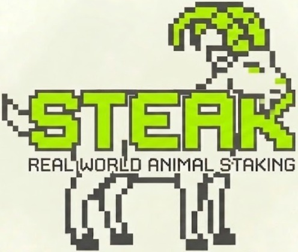

# Steak Protocol 🥩🐐🐄

Steak Protocol is a decentralized Real World Asset (RWA) platform on the Solana blockchain, focused on the livestock industry in Indonesia. It allows users to invest in verified physical assets (Goats and Cows) and earn stable yields (Fixed Rate APY) paid in IDRX.

## 🌟 Key Features

- **On-Chain Transparency**: All investment batches (series) and transactions are recorded on the Solana blockchain.
- **Fixed Rate APY**: Predictable yields calculated based on livestock valuation growth.
- **Physical Asset Backing**: Every investment series is backed by insured and verified livestock assets.
- **NFT Proof-of-Stake**: Investors receive digital certificates in the form of NFTs for every successful stake.
- **IDRX Ecosystem**: Fully integrated with the IDRX stablecoin for stable regional valuation.

## 🛠 Tech Stack

- **Blockchain**: Solana, Anchor Framework (Rust)
- **Frontend**: React, Vite, Tailwind CSS, Framer Motion
- **Wallet Integration**: Solana Wallet Adapter (Phantom, Solflare, etc.)
- **Tokens**: SPL-Token (IDRX Mint)

---

## 🚀 On-Chain Simulation Guide

Follow this guide to simulate the full lifecycle of a livestock series from Admin creation to User withdrawal on **Solana Devnet**.

### 🏛 Phase 1: Preparation (Admin)
1. **Connect Wallet**: Use a Solana wallet set to **Devnet**.
2. **Setup Protocol**: Navigate to the **Admin Page** and click **"Initialize Protocol"**. This creates the master global state on-chain.
3. **Get Test IDRX**: Use the **"Get Test IDRX"** tool in the sidebar to fund your wallet with at least 10,000,000 IDRX for testing.

### 🏛 Phase 2: Admin Operations (Create Series)
1. **Create New Batch**: Click **"New Batch"**.
   - Set **Duration** (e.g., 30 Days).
   - Set **Max Quota** (e.g., 5,000,000 IDRX).
   - Specify **Livestock Count** (Goats/Cows).
2. **Deployment**: Once the transaction is successful, the series will appear with an **"Upcoming"** status. Investment is now open.

### 🥩 Phase 3: User Operations (Invest)
1. **Explore Pools**: Go to the **Earn** page and find the newly created series.
2. **Stake**: Enter the amount (e.g., 1,000,000 IDRX) and click **"Stake Now"**.
   - *Note: If you encounter an "Insufficient Funds" error, please use the faucet again.*
3. **Portfolio**: After staking, check **My Portfolio**. You will see your investment certificate marked as **"Active"**.

### ⏳ Phase 4: Admin Operations (Start & Harvest)
1. **Start Batch**: On the **Admin Page**, click **"Start"** for the batch.
   - *Status changes to **"Live"**. No more investments are allowed for this batch.*
2. **Harvest (Settlement)**: When the livestock cycle is complete, click **"Harvest"**.
   - **Important**: The Admin must have sufficient IDRX balance `(Principal + Profit)` in their wallet to settle the batch. For a 5M IDRX batch with 500k profit, the Admin needs 5.5M IDRX to successfully harvest.

### 💰 Phase 5: User Operations (Claim Funds)
1. **Withdraw**: Go back to **My Portfolio**.
2. **Claim**: The **"Withdraw"** button will now be active (since the Admin has harvested).
3. **Result**: Your principal plus the accrued yield will be transferred directly to your wallet.

---

## ❓ Troubleshooting

- **0x1 / Insufficient Funds**: Your IDRX balance is too low. Use the "Get Test IDRX" button.
- **0xbc4 / AccountDidNotDeserialize**: Data mismatch with an old batch. Try creating a new Batch ID or refresh the page.
- **BatchAlreadyStarted**: You are trying to stake in a batch that has already been started by the Admin. Look for "Upcoming" pools.

---

Built with ❤️ for the Solana Hackathon. 🐐🔥🏆
